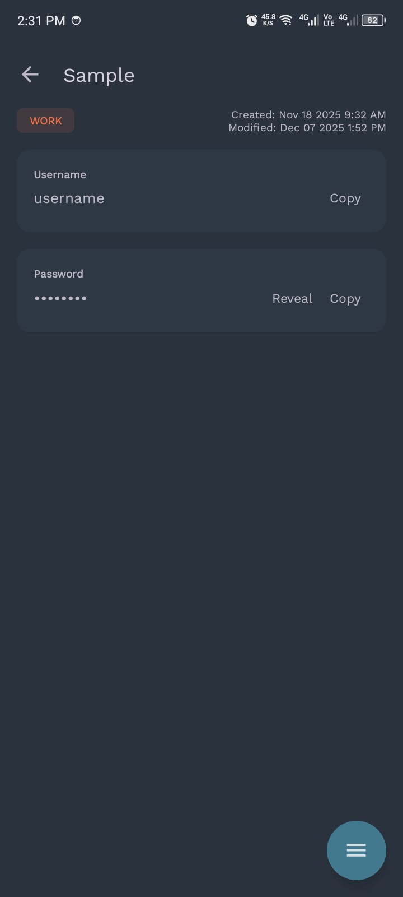
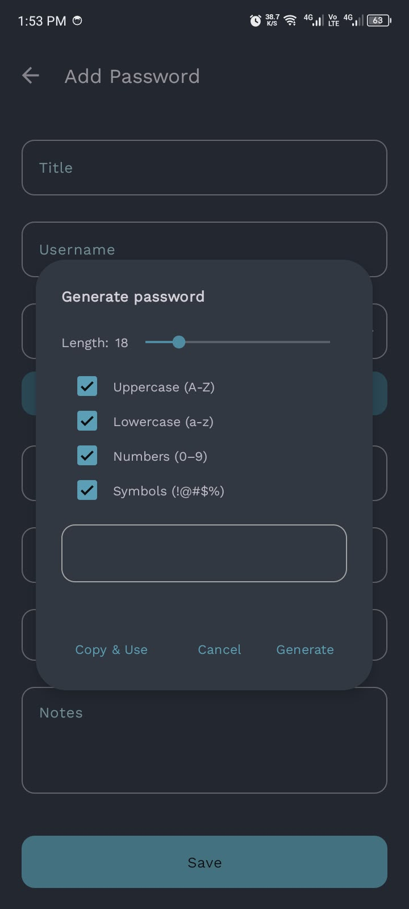
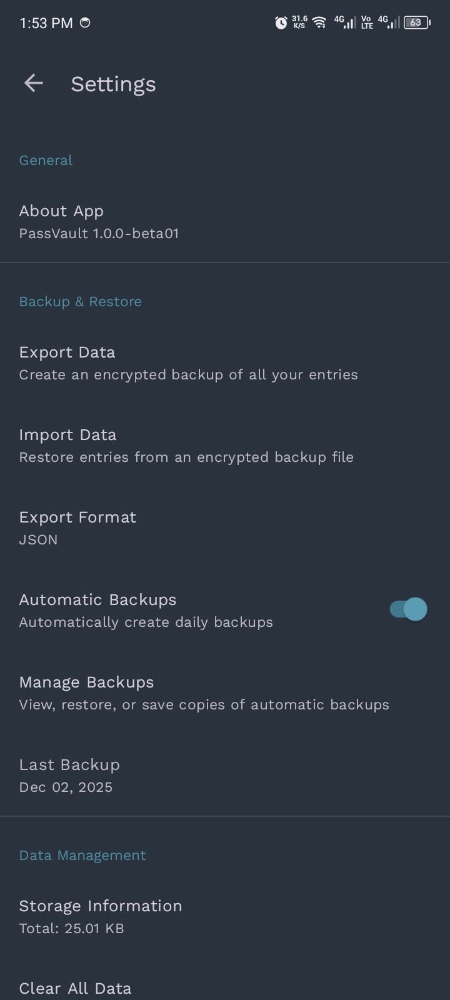

<h1 align="center">
   
    
   
  PassVault
   
</h1>

<h4 align="center">A secure, lightweight, and offline password manager for Android built with Kotlin.</h4>

<h4 align="center">

  

</h4>

<h1 align="center">
    
  
  
    
    
  
   
  
   
</h1>

PassVault is a lightweight password manager that allows users to securely store credentials on their
device. All data is stored locally and sensitive information is encrypted using the Android Keystore
system. The application does not require internet permissions. User data never leaves the device.

## Core Features

- [x] Secure PIN Authentication
- [x] Biometric (Fingerprint) Login
- [x] Encrypted Database (AES-256)
- [x] Add, View, Edit, & Delete Passwords
- [x] In-app Password Generator
- [X] Encrypted Import/Export (for backups and transfer)
- [X] Encrypted Automatic Backups

## Planned Features

- [ ] Secure Notes (for storing non-password secrets)
- [ ] Desktop Version
- [ ] Categories/Labels
- [ ] Import from KeePass/Bitwarden

## Download

 
 

 

## Tech Stack & Architecture

This project follows the MVVM (Model-View-ViewModel) architecture.

- **Language**: Kotlin
- **UI**: XML Layouts with ViewBinding and Material Design Components
- **Database**: Room Persistence Library
- **Architecture**: ViewModel, Repository, LiveData
- **Security**: Android Keystore, AES/CBC/PKCS7 Encryption
